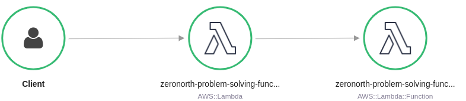
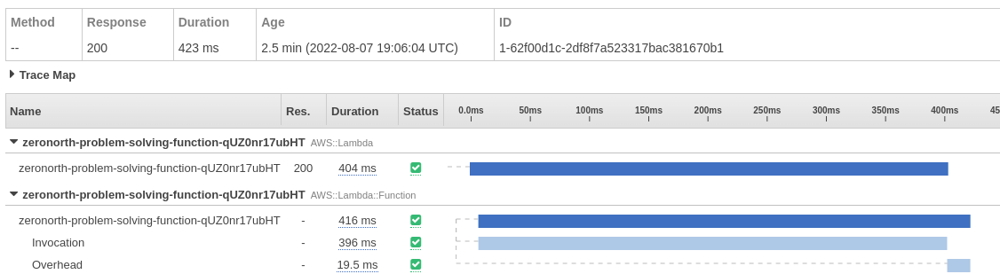

# Project Structure, Deployment and Testing


The project source includes function code and supporting resources:
- `ZN coding challege.pdf` - Problem specification.
- `src/main` - A Java Function in `handler`.
- `src/test` - A unit test and helper classes.
- `notebokes` - Regression Model from given data source.
- `samples` - Given data sample and request format.
- `template.yml` - An AWS CloudFormation template that creates an application.
- `build.gradle` - A Gradle build file.
- `pom.xml` - A Maven build file.
- `1-create-bucket.sh`, `2-deploy.sh`, etc. - Shell scripts that use the AWS CLI to deploy and manage the application.

Use the following instructions to deploy the sample application.

# Requirements
- [Java 8 runtime environment (SE JRE)](https://www.oracle.com/java/technologies/javase-downloads.html)
- [Gradle 5](https://gradle.org/releases/) or [Maven 3](https://maven.apache.org/docs/history.html)
- The Bash shell. For Linux and macOS, this is included by default. In Windows 10, you can install the [Windows Subsystem for Linux](https://docs.microsoft.com/en-us/windows/wsl/install-win10) to get a Windows-integrated version of Ubuntu and Bash.
- [The AWS CLI](https://docs.aws.amazon.com/cli/latest/userguide/cli-chap-install.html) v1.17 or newer.

If you use the AWS CLI v2, add the following to your [configuration file](https://docs.aws.amazon.com/cli/latest/userguide/cli-configure-files.html) (`~/.aws/config`):

```
cli_binary_format=raw-in-base64-out
```

This setting enables the AWS CLI v2 to load JSON events from a file, matching the v1 behavior.

# Setup
Download or clone this repository.

    $ git clone https://github.com/tanvir86/zeronorth-problem-solving.git
    $ cd zeronorth-problem-solving

To create a new bucket for deployment artifacts, run `1-create-bucket.sh`.

    zeronorth-problem-solving$ ./1-create-bucket.sh
    make_bucket: lambda-artifacts-a5e4xmplb5b22e0d

# Deploy
To deploy the application, run `2-deploy.sh`.

    zeronorth-problem-solving$ ./2-deploy.sh
    BUILD SUCCESSFUL in 1s
    Successfully packaged artifacts and wrote output template to file out.yml.
    Waiting for changeset to be created..
    Successfully created/updated stack - zeronorth-problem-solving

This script uses AWS CloudFormation to deploy the Lambda functions and an IAM role. If the AWS CloudFormation stack that contains the resources already exists, the script updates it with any changes to the template or function code.

You can also build the application with Maven. To use maven, add `mvn` to the command.

    zeronorth-problem-solving$ ./2-deploy.sh mvn
    [INFO] Scanning for projects...
    [INFO] -----------------------< com.zeronorth:zeronorth-problem-solving >-----------------------
    [INFO] Building zeronorth-problem-solving 1.0-SNAPSHOT
    [INFO] --------------------------------[ jar ]---------------------------------
    ...

# Test
To invoke the function, run `3-invoke.sh`.

    zeronorth-problem-solving$ ./3-invoke.sh
    {
        "StatusCode": 200,
        "ExecutedVersion": "$LATEST"
    }
    [{"fuelConsumptionInMetricTon":422.64571056674174,"co2EmissionInMetricTon":1316.1187773685406,"eco":true},{"fuelConsumptionInMetricTon":441.351698984272,"co2EmissionInMetricTon":1374.36922683492,"eco":false},{"fuelConsumptionInMetricTon":445.80025455298573,"co2EmissionInMetricTon":1388.2220292407474,"eco":false}]

Let the script invoke the function a few times and then press `CRTL+C` to exit.

The application uses AWS X-Ray to trace requests. Open the [X-Ray console](https://console.aws.amazon.com/xray/home#/service-map) to view the service map.



Choose a node in the main function graph. Then choose **View traces** to see a list of traces. Choose any trace to view a timeline that breaks down the work done by the function.




# Cleanup
To delete the application, run `4-cleanup.sh`.

    java-basic$ ./4-cleanup.sh


# Solution Process and Thoughts on Further Improvement
**Solution Architecture**


## Why AWS Lambda?
- Our other option EC2 instance is a bit overkill as  our solution was to provide a single API. Using EC2, we had to make at least 2 instance up and running all the time for high availability, So in off-peak time we would have to waste lots of compute time / money.
- Another aspect is the scaling requirement of 25k+ TPS for optimisation team. For this, our scaling options in case of EC2 are over-provisioning or Automatic Scaling. For over-provisioning new request processing start instantly whereas Autoscaling will take ~5 minutes. But Over-provisioning is highly costly. But with other alternative Serverless Lambda, we can setup auto-scaling with minimum processing start time and this is far less costly than EC2 solution.  

## Solution process
1. Feature task(API request) can be broken down to lots of independent task/calculation; to keep the API response time within acceptable minimum, I tried to add parallel processing (threading) for these task.
   - Maybe we can choose another Language which has better support for concurrency & multiprocessing.
2. Weather API request is Blocking i/o in respect to our solution - API request can take variable amount of time, also the huge number of Weather API request needed for our solution makes it worse. However, we are doing same request multiple times which can be avoided by using caching. I have added simple in-memory cache. Moreover, I only considered the scenario where every Weather api call is successful (return 200 status code within acceptable time) in the project code.
   - Need to add fault tolerance for scenario like network partition, Weather Service down, takes long time to response.
   - Need to add separate Caching Service like ElastiCache for weather response caching. Doing so, all lambda function instances will be able to use the same cache data. But need to consider the cache eviction policy.
3. Query Value from Fuel Table: This seems to be classic Regression Machine Learning problem. I trained linear regression model for each vessel. But accuracy is terrible.
   - Need to improve accuracy, consider other regression model.
4. Fitting the Model in the Solution: I have hardcoded the model date in the solution for the demo purpose.
   - We need to consider the case wheather these model will only be used by this lamda only. If yes then it is ok to integrate into our lamda, but if not, then it is better to build a service/lamda serving these model only. So our application will be de-couoled, and when new model comes/changed, we will need to change in only one place.
   - Now even if we add these model in our lamda, we need to add in a way that model data change or new model add can be done dynamically. In that case, it will be best to get the model data from a database.

# Scaling up-to 25k+
We have to Consider All of our services namely API Gateway, Lambda Function, ElastiCache and Weather Service for this scaling requirement.

## Lambda Function Scaling:
- Here, For Lambda function AWS regional Concurrency quota by default is 1000. So we have to increase the concurrency quota to our desired Concurrency likely 25k+. (It is important to keep in mind, concurrency limit is shared across all the functions in your account that are in a specific AWS Region).
- Now our Function should be able to handle 25K + concurrent request. But by default lambda provisioned function when new request comes. And here comes burst concurrency limit. Which vary dependent on region. In EU (Ireland), it is 3000. So if request start to come more than 3000 at a time, aws will add new container at 500/min rate after initial burst of 3000. So we will get request throttling error (429 status code).
- Here comes `Provisioned concurrency`. When you configure a number for provisioned concurrency, Lambda initializes that number of execution environments. Your function is ready to serve a burst of incoming requests with very low latency. So we have to provisioned concurrency to 25k+!.
- But Lambda incur charges for provisioned concurrency. Moreover, We will not require 25k+ concurrency all the time. In this case, we can use autoscaling for provisioned concurrency. We can create a target tracking scaling policy that adjusts provisioned concurrency levels automatically, based on the utilization metric that Lambda emits.

## API gateway Scaling:
- Here default quota per account per region is "10,000 requests per second (RPS) with an additional burst capacity provided by the token bucket algorithm, using a maximum bucket capacity of 5,000 requests". So we have to increase this quota to handle our workload.

## ElastiCache
- if each API request create 10 concurrent ElastiCache request then Elasticache have to handle 250K concurrent request (for 25k concurrent api request).

## Weather Service
- If 20% of the above request is a cache miss, then weather service have to handle (250k * 20% =) 50k on average. But request spike can happen when cache data is empty and request comes at our API in Burst.

I have tried to address all the critical area for this requirement (25k+ request). But in practice, after addressing the above mentioned area, we need to do load test to assess our service behavior before going to production. 
